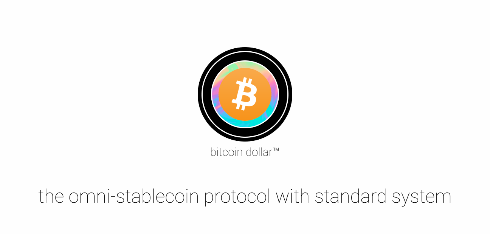

# Standard Protocol

Standard protocol is the omni-stablecoin protocol secured with stability mechanisms and collaterized by digital assets across blockchains.

Before getting started with this repo, please read:

* The [Standard Protocol Documentation](docs.standardprotocol.org), describing how Standard Protocol works

For questions about interacting with Standard protocol, please visit [our Discord server](https://chat.standardprotocol.org).

For security concerns, email [security@standardprotocol.org](mailto:security@standardprotocol.org).

# Checklist

ReserveBank.sol

- [x] Implement WBTC->STC exchange
- [ ] BTD->STC
- [ ] Setup stability mechanism
- [ ] 
- [ ]

# Documentation

Discussion
----------

For any concerns with the protocol, open an issue or visit us on [Discord](chat.standardprotocol.org) to discuss.

For security concerns, please email [security@standardprotocol.org](mailto:security@standardprotocol.org).

_© Copyright 2020, Digital Native_

